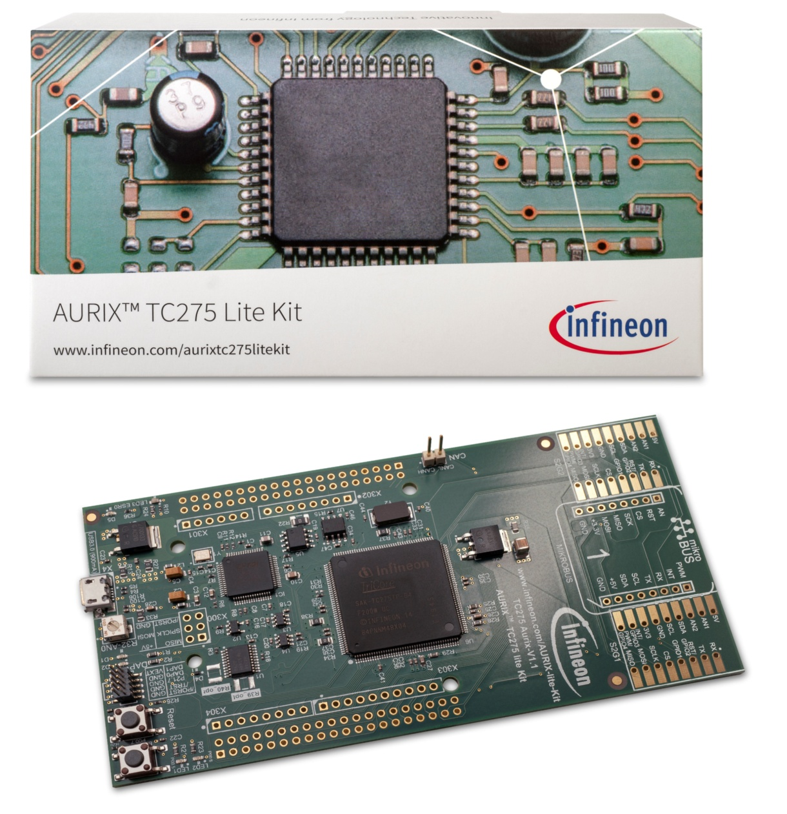
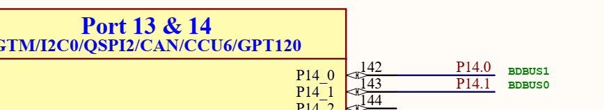
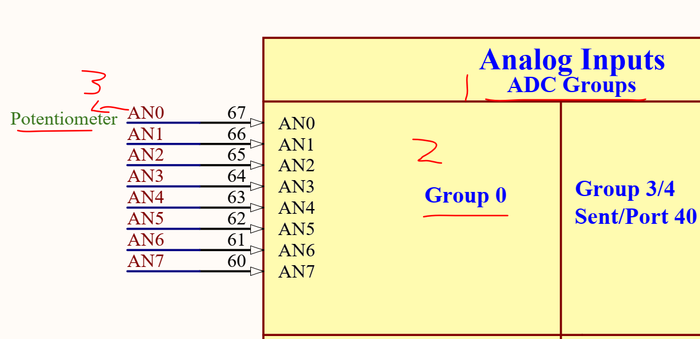
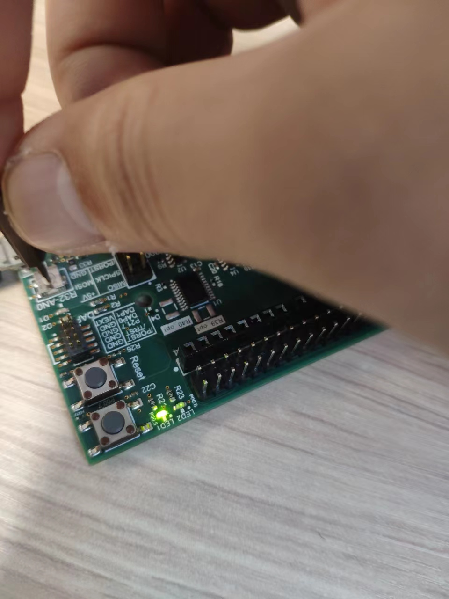
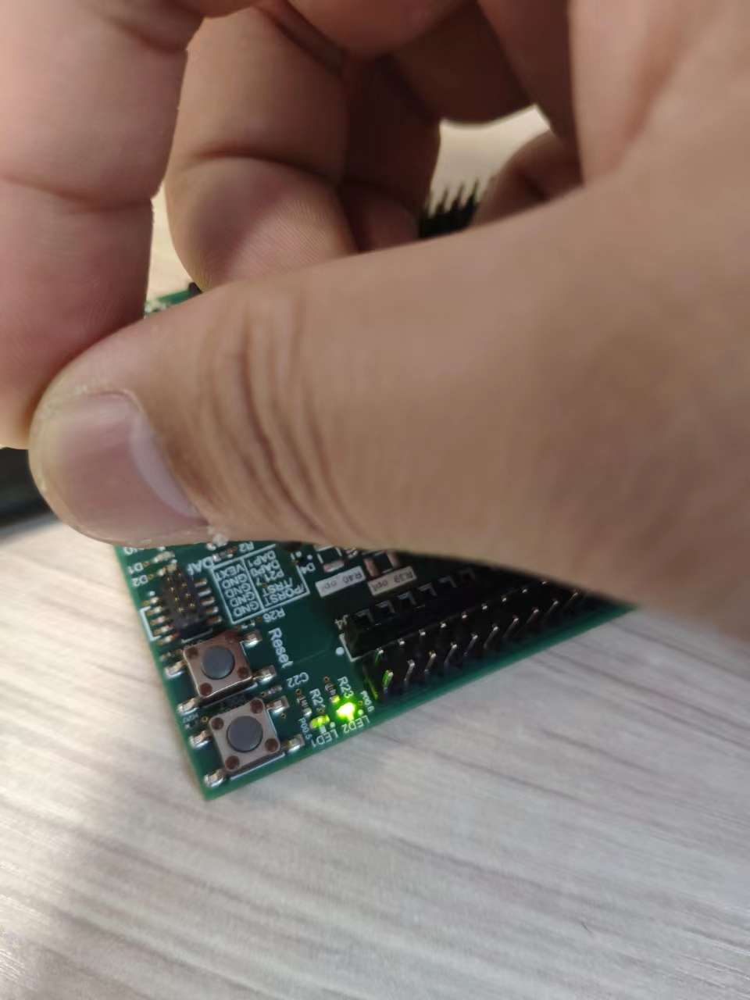

# Funpack第二季第二期：KIT_AURIX_TC275_LITE 活动

## 主要内容框架

**1、板卡介绍**

**2、任务目标**

**3、开发环境**

**4、应用开发**

**5、心得体会**

**活动主页：[Funpack第二季第二期：KIT_AURIX_TC275_LITE - 电子森林 (eetree.cn)](https://www.eetree.cn/project/detail/1101)**

有幸参加**硬禾学堂**、**得捷电子**和**英飞凌**举办的这一期的活动，了解嵌入式相关的知识和英飞凌单片机的使用。

## 1、板卡介绍

AURIX TM TC275 lite 套件配备了基于 32 位单芯片 AURIX TM TriCore TM的微控制器 Aurix TM TC275。它可以与一系列开发工具一起使用，包括 AURIX TM Development Studio、英飞凌免费的基于 Eclipse 的 IDE，或来自 Hightec/PLS/Infineon 的基于 Eclipse 的“FreeEntryToolchain”。

特性：

Arduino 连接器

Arduino ICSP 连接器

稳压器 5V 至 3.3V

可选 0 欧姆电阻器（1210 英制中的 R39_opt/R40_opt）

Arduino 连接器（数字）

用于 AURIX™ TM的 20 MHz 晶振和用于 OCDS 的 12 MHz 晶振

用于 WIFI/BLE 的 Mikrobus 连接器

英飞凌 CAN 收发器 TLE9251VSJ 和 CAN 连接器

针连接器 X2

电源指示灯 (D5)

LED D1/D2 用于 ADBUS7/4 和 LED3 用于 ESR0 信号（低电平有效）

Arduino 针连接器（电源和模拟输入）

电位器 (10 kOhm) 和可焊接的 0 Ohm 电阻器（0805 英制中的 R33）

微型 USB（推荐 USB3.0）

10 针 DAP 连接器

复位按钮

2 x Shield2GO 连接器，用于 Infineon Maker Shields

EEPROM 1Kbit

## 2、任务目标

任务二：

设计一个呼吸灯，通过旋转板卡上的电位计，改变呼吸灯闪烁速率，同时将ADC采集的数据通过串口/CAN，发送到另一台设备上显示。

详细描述：

呼吸灯使用的两个LED灯，LED1变亮的时候LED2变暗，作为对比显示PWM调光的作用。使用12位ADC读取板卡的电位计（电位计的电压是3.3V，ADC的量程是0-4095）。使用板卡内部资源GTM定时器产生PWM波对LED灯进行调光。使用串口发送ADC和值和换算之后的电压值到串口调试助手上面。

## 3、开发环境

win10专业版，串口调试助手：fireTools.exe，开发工具：AURIX Development Studio

### 3.1、编译软件的安装

**AURIX Development Studio**的安装和下载均可以参考网上的教程来做，串口调试助手用哪个都可以。

安装教程：[AURIX™ Development Studio 安装使用_lijk15的博客-CSDN博客](https://blog.csdn.net/lijk15/article/details/108896484)

软件的下载地址：[Tool overview - Infineon Developer Center](https://softwaretools.infineon.com/tools?q=aurix)

软件的使用教程可参考硬禾学堂发布的文章，[英飞凌AURIX Development Studio安装和使用，助力Funpack2-2 - 哔哩哔哩 (bilibili.com)](https://www.bilibili.com/read/cv17627610?spm_id_from=333.999.0.0)

**注意**：安装的时候请务必保证ADS安装路径没有中文与空格！初次打开需要选定工作空间路径，请注意工作空间路径不要包含中文以及空格！

## 4、应用开发

根据任务要求已经知道了要做哪些事情，可以将任务分成：**串口**、**ADC**、**PWM**、**LED** 灯几个部分来完成。

### 4.1、LED灯点灯部分

参考资料：[Blinky LED (infineon.com)](https://www.infineon.com/dgdl/Infineon-Blinky_LED_1_KIT_TC275_LK-Training-v01_02-EN.pdf?fileId=5546d4627a0b0c7b017a586733384c8a)

电路图如下


LED灯初始化步骤

LED灯的初始化使用函数 `IfxPort_setPinModeOutput()` 

关闭 LED 灯 函数`IfxPort_setPinHigh()`

LED 的状态可通过函数`IfxPort_togglePin()`

延时函数`waitTime()`延时一秒钟

代码讲解

```c
/*Blinky_LED.c*/
#include "IfxPort.h"   
#include "Bsp.h"
#define LED         &MODULE_P00,6   /*引脚定义*/                                           
#define WAIT_TIME   1000            /*延时时间*/                           

/*该函数初始化驱动 LED 的端口引脚*/
void initLED(void)
{
    /*本例中使用的 LED 的初始化*/
    IfxPort_setPinModeOutput(LED, IfxPort_OutputMode_pushPull, IfxPort_OutputIdx_general);

    /* Switch OFF the LED (low-level active) */
    /*设置LED引脚为高电平*/
    IfxPort_setPinHigh(LED);
}

/* This function toggles the port pin and wait 500 milliseconds */
/*此函数切换端口引脚并等待 500 毫秒*/
void blinkLED(void)
{
    IfxPort_togglePin(LED);      /*LED灯翻转*/                                 
    waitTime(IfxStm_getTicksFromMilliseconds(BSP_DEFAULT_TIMER, WAIT_TIME));    
}

/*core0_main.c*/
int core0_main(void)
{
    /* 基本的芯片初始化操作-案例程序中通用的未改动
     * ......
     */
    initLED();  /* 初始化LED引脚      */

    while(1)
    {
        blinkLED(); /* Make the LED blink    LED灯闪烁-间隔0.5s       */
    }
    return (1);
}
```

这样就可以点亮 LED 灯或者配置基本的 IO 口。如果使用多核心也是如此调用初始化函数，把用户定义的线程放入 while(1) 中即可。

### 4.2、串口学习部分

参考资料：[UART communication via ASCLIN module (infineon.com)](https://www.infineon.com/dgdl/Infineon-AURIX_ASCLIN_UART_1_KIT_TC275_LK-TR-Training-v01_00-EN.pdf?fileId=5546d4627a0b0c7b017a5845b0422526)

电路图如下：



串口的配置

用于 UART 通信的 ASCLIN 模块的配置在设置阶段完成
通过使用以下内容初始化`IfxAsclin_Asc_Config`结构体的实例
参数：
`baudrate` - 以比特/秒为单位设置实际通信速度的结构
`interrupt` - 要配置的结构：

    发送和接收中断优先级（txPriority，rxPriority）
    typeOfService – 定义哪个服务提供者负责处理中断，可以是任何可用的 CPU 或 DMA
`pin` - 设置用于通信的 GPIO 端口引脚的结构体
`rxBuffer`, `rxBufferSize`, `txBuffer`, `txBufferSize`– 配置将容纳的缓冲区传入/传出数据
函数`IfxAsclin_Asc_initModuleConfig()`用 默认值和`IfxAsclin_Asc_initModule()`使用用户初始化模块配置

调用`IfxAsclin_Asc_write()`和`IfxAsclin_Asc_read()`函数发送和接收串口数据

代码讲解部分

```c
/**/
#include "IfxAsclin_Asc.h"
#include "IfxCpu_Irq.h"
#include "Bsp.h"

#define UART_BAUDRATE           115200       /* 串口波特率 bit/s */
#define UART_PIN_RX             IfxAsclin0_RXA_P14_1_IN /*串口接收引脚 */
#define UART_PIN_TX             IfxAsclin0_TX_P14_0_OUT /* 串口发送引脚 */

/* Definition of the interrupt priorities -定义串口中断的优先级*/
#define INTPRIO_ASCLIN0_RX      18 
#define INTPRIO_ASCLIN0_TX      19

#define UART_RX_BUFFER_SIZE     64        /* 定义接收缓存区大小 */
#define UART_TX_BUFFER_SIZE     64        /* 定义发送缓存区大小 */
#define SIZE                    13        /* 字符串大小  */
#define WAIT_TIME   1000                  /* 定义等待时间 */                                     

IfxAsclin_Asc g_ascHandle;    //声明串口配置的结构体

/* Declaration of the FIFOs parameters -定义FIFO的参数*/
static uint8 g_ascTxBuffer[UART_TX_BUFFER_SIZE + sizeof(Ifx_Fifo) + 8];
static uint8 g_ascRxBuffer[UART_RX_BUFFER_SIZE + sizeof(Ifx_Fifo) + 8];

/* Definition of txData and rxData -定义发送和接收的数据缓存区*/
uint8 g_txData[] = "Hello World!";
uint8 g_rxData[SIZE] = {''};

/* Size of the message - 发送信息的大小 */
Ifx_SizeT g_count = sizeof(g_txData);  

/* Adding of the interrupt service routines 添加中断服务程序-对应发送和接收中断设置的优先级*/
IFX_INTERRUPT(asclin0TxISR, 0, INTPRIO_ASCLIN0_TX);
void asclin0TxISR(void)
{
    IfxAsclin_Asc_isrTransmit(&g_ascHandle);   /* 中断发送函数 */
}

IFX_INTERRUPT(asclin0RxISR, 0, INTPRIO_ASCLIN0_RX);
void asclin0RxISR(void)
{
    IfxAsclin_Asc_isrReceive(&g_ascHandle);  /* 中断接收函数 */
}

/* This function initializes the ASCLIN UART module -串口的初始化配置*/
void init_ASCLIN_UART(void)
{
    /* Initialize an instance of IfxAsclin_Asc_Config with default values */
    /*使用默认值初始化 IfxAsclin_Asc_Config 的实例*/
    IfxAsclin_Asc_Config ascConfig;
    IfxAsclin_Asc_initModuleConfig(&ascConfig, &MODULE_ASCLIN0);

    /* Set the desired baud rate -设置波特率*/
    ascConfig.baudrate.baudrate = UART_BAUDRATE;

    /* ISR priorities and interrupt target -ISR 优先级和中断引脚（串口引脚）*/
    ascConfig.interrupt.txPriority = INTPRIO_ASCLIN0_TX;
    ascConfig.interrupt.rxPriority = INTPRIO_ASCLIN0_RX;
    ascConfig.interrupt.typeOfService = IfxCpu_Irq_getTos(IfxCpu_getCoreIndex());

    /* FIFO configuration -FIFO的配置*/
    ascConfig.txBuffer = &g_ascTxBuffer;
    ascConfig.txBufferSize = UART_TX_BUFFER_SIZE;
    ascConfig.rxBuffer = &g_ascRxBuffer;
    ascConfig.rxBufferSize = UART_RX_BUFFER_SIZE;

    /* Pin configuration -引脚的配置*/
    const IfxAsclin_Asc_Pins pins =
    {
        NULL_PTR,       IfxPort_InputMode_pullUp,     /* CTS 未用 */
        &UART_PIN_RX,   IfxPort_InputMode_pullUp,     /* RX 接收引脚 */
        NULL_PTR,       IfxPort_OutputMode_pushPull,  /* RTS未用*/
        &UART_PIN_TX,   IfxPort_OutputMode_pushPull,  /* TX 发送引脚 */
        IfxPort_PadDriver_cmosAutomotiveSpeed1   /*GPIO的速度设置*/
    };
    ascConfig.pins = &pins;
    /* 使用上述参数初始化模块*/
    IfxAsclin_Asc_initModule(&g_ascHandle, &ascConfig); 
}

/* This function sends and receives the string "Hello World!" */
/*发送数据和接收数据，当RX和TX连接在一起*/
void send_receive_ASCLIN_UART_message(void)
{    
    /* Transmit data via TX */
    IfxAsclin_Asc_write(&g_ascHandle, g_txData, &g_count, TIME_INFINITE);   
    /* Receive data via RX  */    
    IfxAsclin_Asc_read(&g_ascHandle, g_rxData, &g_count, TIME_INFINITE);    
}

/* Function to transmit data over UART -使用串口发送数据*/
void send_data(char *data, Ifx_SizeT length)
{
    /* Transmit data */
    IfxAsclin_Asc_write(&g_ascHandle, data, &length, TIME_INFINITE);
}

/* Function to receive data over ASC -使用串口接收数据*/ 
void receive_data(char *data, Ifx_SizeT length)
{
    /* Receive data */
    IfxAsclin_Asc_read(&g_ascHandle, data, &length, TIME_INFINITE);
}


/* core0_main.c*/
int core0_main(void)
{
    /* 基本的芯片初始化操作-案例程序中通用的未改动
     * ......
     */
    init_ASCLIN_UART();                 /* 初始化串口                 */
    send_receive_ASCLIN_UART_message(); /* 串口的发送和接收测试-未使用接收功能 */

    while(1)
    {
    }
    return (1);
}
```

实验结果：串口调试助手显示 **Hello World!**

### 4.3、ADC 学习部分

参考资料：[Auto Scan of ADC channel (infineon.com)](https://www.infineon.com/dgdl/Infineon-AURIX_ADC_Group_Scan_1_KIT_TC275_LK-TR-Training-v01_00-EN.pdf?fileId=5546d4627a0b0c7b017a58679bdf4c9f)

电路图如下：



VADC的配置

以下iLLD函数用于初始化: 头文件`IfxVadc_Adc.h`

`IfxVadc_Adc_initModuleConfig()`使用默认值初始化模块结构

`IfxVadc_Adc_initModule()`初始化VADC以预期的频率和校准运行

`IfxVadc_Adc_initGroupConfig()`使用默认配置初始化组缓冲区

`IfxVadc_Adc_initGroup()`初始化参数中指定的VADC组  

需要在通道上进行循环来配置、初始化和设置它们。然后可以启动ADC。

每个通道的初始化和配置是通过两个iLLD函数完成的:

`IfxVadc_Adc_initChannelConfig()`，它使用默认通道配置初始化缓冲区

`IfxVadc_Adc_initChannel()`，用户配置初始化指定的通道

通道通过`IfxVadc_Adc_setScan()`和转换被添加到扫描序列中首先调用函数`IfxVadc_Adc_startScan()`

代码讲解和初始化过程

```c
#include "ADC_Group_Scan.h"  
#include "ASCLIN_UART.h"   //与上文讲解的串口函数一致

#define RX_LENGTH           1       /* Size of the expected input -未使用                      */
#define TX_LENGTH           21      /* 设置发送数据缓存区的长度    */

#define N_CHANNELS              1           /* 定义被使用的通过个数                       */
#define ASCII_SHIFT             48          /* Shift in the ASCII table: '0', '1', '2'[...], start at value 48  */
#define change_data             0.8057      //电压和测量值的转换 3300/4096
IfxVadc_Adc g_vadc;                         /* VADC 寄存器句柄                                        */
IfxVadc_Adc_Group g_adcGroup;                   /* VADC 组寄存器的句柄                             */
IfxVadc_Adc_Channel g_adcChannel[N_CHANNELS];   /* VADC 通道寄存器的句柄*/
/* Define the used channels -定义的使用的通道*/
IfxVadc_ChannelId g_vadcChannelIDs[] = {IfxVadc_ChannelId_0}; /* AN36: channel 0 of group 0 */
//                                      IfxVadc_ChannelId_1,  /* AN37: channel 1 of group 0 */
//                                      IfxVadc_ChannelId_2,  /* AN38: channel 2 of group 0 */
//                                      IfxVadc_ChannelId_3}; /* AN39: channel 3 of group 0 */

/* VADC 模块和将使用的组的配置和初始化 */
//ADC初始化
void init_vadc(void)
{
    /*创建和初始化模块配置 */
    IfxVadc_Adc_Config adcConf;                             /* 定义 VADC 模块的配置结构 */
    IfxVadc_Adc_initModuleConfig(&adcConf, &MODULE_VADC);   /* 用默认值配置它*/

    IfxVadc_Adc_initModule(&g_vadc, &adcConf);              /* 将配置应用到模块*/

    /* 创建和初始化组配置 */
    IfxVadc_Adc_GroupConfig adcGroupConf;                   /* 定义 VADC 组的配置结构*/
    IfxVadc_Adc_initGroupConfig(&adcGroupConf, &g_vadc);    /* 用默认值配置它*/

    /* Configuration of the group -VADC组的配置*/
    adcGroupConf.groupId = IfxVadc_GroupId_0;               /*选择VADC组0 */
    adcGroupConf.master = adcGroupConf.groupId;             /* 选择主组*/

    adcGroupConf.arbiter.requestSlotScanEnabled = TRUE;     /* 启用扫描ADC各个通道*/
    adcGroupConf.scanRequest.autoscanEnabled = TRUE;        /* 启用自动扫描模式*/

    /* Enable all gates in "always" mode (no edge detection) 在“始终”模式下启用所有门（无边缘检测）*/
    adcGroupConf.scanRequest.triggerConfig.gatingMode = IfxVadc_GatingMode_always;

    IfxVadc_Adc_initGroup(&g_adcGroup, &adcGroupConf);      /* 将配置应用到组*/

    /* Create and initialize the channels configuration 创建和初始化通道配置*/
    uint32 chnIx;

    /* Create channel configuration 创建通道配置*/
    IfxVadc_Adc_ChannelConfig adcChannelConf[N_CHANNELS]; /* 定义 VADC 通道的配置结构 */

    for(chnIx = 0; chnIx < N_CHANNELS; ++chnIx)         /* 此处只使用了一个通道 */
    {
        IfxVadc_Adc_initChannelConfig(&adcChannelConf[chnIx], &g_adcGroup);     /* Fill it with default values */

        adcChannelConf[chnIx].channelId = g_vadcChannelIDs[chnIx];              /* Select the channel ID */
        adcChannelConf[chnIx].resultRegister = (IfxVadc_ChannelResult)(chnIx);  /* Use dedicated result register */

        /* 初始化通道 */
        IfxVadc_Adc_initChannel(&g_adcChannel[chnIx], &adcChannelConf[chnIx]);

        /* 将通道添加到扫描序列*/
        uint32 enableChnBit = (1 << adcChannelConf[chnIx].channelId);   /*  设置对应的输入通道 */
        uint32 mask = enableChnBit;                                     /* 参加的各组  */
        IfxVadc_Adc_setScan(&g_adcGroup, enableChnBit, mask);           /* 扫描序列 */
    }

    /* Start the scan -开始读取VADC组中的各个ADC通道*/
    IfxVadc_Adc_startScan(&g_adcGroup);
}

/* 获取和打印 VADC 转换 */
void run_vadc(void)
{
    uint32 chnIx;

    /* Get the VADC conversions -获取ADC的转换值*/
    for(chnIx = 0; chnIx < N_CHANNELS; ++chnIx)   //每个通道依次计算得到ADC的数字量
    {
        Ifx_VADC_RES conversionResult;

        /* Wait for a new valid result */
        do
        {
            conversionResult = IfxVadc_Adc_getResult(&g_adcChannel[chnIx]);
        } while(!conversionResult.B.VF); /*B 表示位域访问，VF 表示有效标志 */

        /* 将ADC值使用UART发送 */
        send_vadc(chnIx, conversionResult.B.RESULT);
    }
}

/* Print, via UART, the VADC results after conversions */
void send_vadc(uint32 chnIx, uint32 adcVal)
{

    //打印格式 Ch.x:xxxx,  V:x.xxx   
    char str[TX_LENGTH] = {'C','h','.','X',':',' ','X','X','X','X',' ',' ','V',':','X','.','X','X','X','\n','\r'};  /* X to be replaced by correct values*/
    uint32 num = 0;
    num = adcVal * change_data;   //此时的值为ADC的电压值 = 数字量*转换值
    str[3] = (char) chnIx + ASCII_SHIFT;                                        /* Channel index  */

    /* Turns the digital converted value into its ASCII characters, e.g. 1054 -> '1','0','5','4' */
    /* 12-bits range value: 0-4095*/
    //打印输出此时测量的数字量和转换得到的电压值
    str[6] = (adcVal / 1000) + ASCII_SHIFT;                                     /* Thousands  */
    str[7] = ((adcVal % 1000) / 100) + ASCII_SHIFT;                             /* Hundreds */
    str[8] = ((adcVal % 100) / 10) + ASCII_SHIFT;                               /* Tens */
    str[9] = (adcVal % 10) + ASCII_SHIFT;                                       /* Units*/
    //此时的电压值 
    str[14] = (num / 1000) + ASCII_SHIFT;                                     /* Thousands */
    str[16] = ((num % 1000) / 100) + ASCII_SHIFT;                             /* Hundreds */
    str[17] = ((num % 100) / 10) + ASCII_SHIFT;                               /* Tens  */
    str[18] = (num % 10) + ASCII_SHIFT;                                       /* Units  */
    //串口发送
    send_data(str, TX_LENGTH);
}


/*core0_main.c文件中的配置*/
int core0_main(void)
{  
    /*基本cpu的初始化 通用*/
    init_vadc();                /* Initialize the VADC module */
    init_ASCLIN_UART();         /* Initialize the module*/
    IfxCpu_enableInterrupts();  /* Enable interrupts after initialization */

    while(1)
    {
        run_vadc();             /* 得到ADC的转换值*/
        waitTime(IfxStm_getTicksFromMilliseconds(BSP_DEFAULT_TIMER, 100));    /* Wait 100 milliseconds            */
    }
    return (1);
}
```

实验结果：

```c
Ch.0: 4093  V:3.297
Ch.0: 4095  V:3.299
Ch.0: 4095  V:3.299
Ch.0: 3972  V:3.200
Ch.0: 3793  V:3.056
Ch.0: 3503  V:2.822
Ch.0: 3496  V:2.816
```

### 4.4、PWM 学习部分

参考资料：[GTM ATOM PWM (infineon.com)](https://www.infineon.com/dgdl/Infineon-AURIX_GTM_ATOM_PWM_1_KIT_TC275_LK-TR-Training-v01_00-EN.pdf?fileId=5546d4627a0b0c7b017a5842191924cf) 

电路图如下：


代码讲解部分

LED 由端口 00 的引脚 5 驱动。引脚的状态由 GTM 的 TOM 定时器产生的 PWM 信号控制，也可以使用其他定时器产生 PWM 波对 LED 灯进行调光。

通用定时器模块 (GTM) 是一种模块化定时器单元，旨在容纳许多定时器应用程序。

内置定时器输出模块 (TOM)，可提供多达 16 个独立通道来生成输出信号。

时钟管理单元 (CMU) 负责GTM 的时钟生成。固定时钟生成 (FXU) 是其子单元之一，它为GTM 模块（包括 TOM）提供五个预定义的不可配置时钟。

**配置ATOM**

ATOM的配置在设置阶段通过调用初始化完成一次

函数`initGtmAtomPwm()`包含以下步骤:

调用函数`IfxGtm_enable()`来启用GTM

使用该功能将CMU时钟0的频率设置为1mhz  `IfxGtm_Cmu_SetClkFrequency ()`

调用函数`IfxGtm_Cmu_enableClocks()`使CMU时钟为0

函数`IfxGtm_Atom_Pwm_initConfig()`初始化结构的一个函数`IfxGtm_Atom_Pwm_Config`及其默认值。

`IfxGtm_Atom_Pwm_Config`结构允许将以下参数设置为初始化

模块:

    `atom` -选择正在计数的atom(在本例中为atom1)

   `atomChannel` -选择驱动LED的通道(在本例中为channel 4)

    `period`—将PWM信号的周期设置为所需值

    `pin.outputPin` -选择LED作为输出引脚

    `synchronousUpdateEnable` -开启同步更新定时器功能

配置之后，函数`IfxGtm_Atom_Pwm_init()`初始化并激活(来重新初始化和重新激活ATOM)

函数`IfxGtm_Atom_Pwm_start()`启动PWM

```c
/*GTM_TOM_PWM.c/
#include "GTM_TOM_PWM.h"   /*此头文件为声明函数所用，其他变量都在.c文件中*/
#include "Ifx_Types.h"
#include "IfxGtm_Tom_Pwm.h"

#define ISR_PRIORITY_TOM    20                                      /* 中断优先级*/
#define LED1                IfxGtm_TOM1_4_TOUT14_P00_5_OUT          /* LED1将会被PWM驱动 */
#define LED2                IfxGtm_TOM1_5_TOUT15_P00_6_OUT          /* LED2将会被PWM驱动，此LED灯为LED1亮度的互补*/
#define PWM_PERIOD          50000                                   /* TOM定时器的PWM   */
#define FADE_STEP           PWM_PERIOD / 100                        /* TOM 的 PWM 占空比  */

IfxGtm_Tom_Pwm_Config g_tomConfig;                                  /* Timer configuration structure*/
IfxGtm_Tom_Pwm_Config g_tomConfig2;                                  /* Timer configuration structure*/
IfxGtm_Tom_Pwm_Driver g_tomDriver;                                  /* Timer Driver structure */
uint32 g_fadeValue = 0;                                             /* Fade value, starting from 0*/
sint8 g_fadeDir = 1;                                                /* Fade direction variable */

/* TOM定时器初始化 */
void initGtmTomPwm(void)
{
    IfxGtm_enable(&MODULE_GTM);           /* 使能 GTM定时器*/

    IfxGtm_Cmu_enableClocks(&MODULE_GTM, IFXGTM_CMU_CLKEN_FXCLK);   /* 使能FXU时钟*/

    /* 使用默认参数初始化配置结构 */  /* 初始化LED的TOM的PWM配置*/
    IfxGtm_Tom_Pwm_initConfig(&g_tomConfig, &MODULE_GTM);
    g_tomConfig.tom = LED1.tom;                                      /* 根据 LED 选择 TOM*/
    g_tomConfig.tomChannel = LED1.channel;                           /* 根据LED选择通道*/
    g_tomConfig.period = PWM_PERIOD;                                 /*设置周期*/
    g_tomConfig.pin.outputPin = &LED1;                               /* 设置LED1作为输出 */
    g_tomConfig.synchronousUpdateEnabled = TRUE;                     /* 启用同步更新*/
    IfxGtm_Tom_Pwm_init(&g_tomDriver, &g_tomConfig);                 /* 初始化 GTM TOM*/

    IfxGtm_Tom_Pwm_initConfig(&g_tomConfig2, &MODULE_GTM);            /*初始化LED2的TOM的PWM的配置和LED1的配置一样*/
    g_tomConfig2.tom = LED2.tom;                                      /* Select the TOM depending on the LED */
    g_tomConfig2.tomChannel = LED2.channel;                           /* Select the channel depending on the LED      */
    g_tomConfig2.period = PWM_PERIOD;                                 /* Set the timer period */
    g_tomConfig2.pin.outputPin = &LED2;                               /* Set the LED port pin as output*/
    g_tomConfig2.synchronousUpdateEnabled = TRUE;                     /* Enable synchronous update */
    IfxGtm_Tom_Pwm_init(&g_tomDriver, &g_tomConfig2);                 /* Initialize the GTM TOM */

    IfxGtm_Tom_Pwm_start(&g_tomDriver, TRUE);                       /* 启动PWM */
}

/* 更新每次PWM占空比 */
void fadeLED(void)
{
    if((g_fadeValue + FADE_STEP) >= PWM_PERIOD)
    {
        g_fadeDir = -1;                         /* */
    }
    else if((g_fadeValue - FADE_STEP) <= 0)
    {
        g_fadeDir = 1;                          /* Set the direction of the fade                */
    }
    g_fadeValue += g_fadeDir * FADE_STEP;       /* Calculation of the new duty cycle            */
    setDutyCycle(1, g_fadeValue);               /* 设置LED1 灯 PWM 的占空比*/
}

/* 设置更新那个LED灯的占空比 */
void setDutyCycle(uint8 led_num, uint32 dutyCycle)
{

    if (led_num == 1)
    {
        g_tomConfig.dutyCycle = dutyCycle;                              /* Change the value of the duty cycle           */
        IfxGtm_Tom_Pwm_init(&g_tomDriver, &g_tomConfig);                /* Re-initialize the PWM                        */
    }
    else
    {
        g_tomConfig2.dutyCycle = dutyCycle;                              /* Change the value of the duty cycle           */
        IfxGtm_Tom_Pwm_init(&g_tomDriver, &g_tomConfig2);                /* Re-initialize the PWM                        */
    }
}


/*Cpu0_main.c*/

int core0_main(void)
{
    /*基本cpu的初始化 通用*/
    /* Initialize a time variable */
    Ifx_TickTime ticksFor10ms = IfxStm_getTicksFromMilliseconds(BSP_DEFAULT_TIMER, WAIT_TIME);

    /* 调用初始化函数 */
    initGtmATomPwm();

    while(1)
    {
        fadeLED();      /* 改变 LED1 的亮度 */
        waitTime(ticksFor10ms);
    }
    return (1);
}
```

实验结果：LED1周期性的变亮和变暗，呼吸灯。

### 4.5、整合部分

各个模块已经介绍完毕，现在开始在`cpu0_main.c`文件中调用初始化函数即可，具体的代码讲解如下：

ADC 获取电位器的数字量之后，需要与PWM波的占空比关联，这样才能使 LED 灯跟随电位计的变化而变化，此时系数计算 `pwm_data = 50000/4096` （可能不合理）。LED 灯是低电平点亮，要想达到电位计的数字量越大 LED 灯越亮的效果还需要更改 PWM 的占空比。

```c
/* ADC_Group_Scan.c */
/* Print, via UART, the VADC results after conversions */
void send_vadc(uint32 chnIx, uint32 adcVal)
{
    char str[TX_LENGTH] = {'C','h','.','X',':',' ','X','X','X','X',' ',' ','V',':','X','.','X','X','X','\n','\r'};  /* X to be replaced by correct values*/
    uint32 num = 0, num0 = 0;
    num0 = adcVal * pwm_data;  //计算PWM的占空比
    num = adcVal * change_data;

    if (num0 >= 50000)  //  大于 50000周期时 设置为 0 此时LED灯最亮
    {
        num0 = 0;
    }
    else            
    {
        num0 = 50000 - num0;  //正常亮度
    }
    setDutyCycle(1, num0);  //设置 LED1 灯的占空比
    num0 = 50000 - num0;  //设置 LED2 灯的占空比，此时LED2和LED1的亮度是互补的，一个亮另外一个就暗
    if (num0 < 5)
    {
        num = 0;
    }
    setDutyCycle(2, num0);  //设置LED2灯的占空比，由于和LED灯的占空比相反
    str[3] = (char) chnIx + ASCII_SHIFT;                                        /* Channel index*/

    /* Turns the digital converted value into its ASCII characters, e.g. 1054 -> '1','0','5','4' */
    /* 12-bits range value: 0-4095*/
    //打印输出此时测量的数字量和转换得到的电压值
    str[6] = (adcVal / 1000) + ASCII_SHIFT;                                     /* Thousands */
    str[7] = ((adcVal % 1000) / 100) + ASCII_SHIFT;                             /* Hundreds */
    str[8] = ((adcVal % 100) / 10) + ASCII_SHIFT;                               /* Tens */
    str[9] = (adcVal % 10) + ASCII_SHIFT;                                       /* Units */
    //此时的电压值
    str[14] = (num / 1000) + ASCII_SHIFT;                                     /* Thousands*/
    str[16] = ((num % 1000) / 100) + ASCII_SHIFT;                             /* Hundreds */
    str[17] = ((num % 100) / 10) + ASCII_SHIFT;                               /* Tens  */
    str[18] = (num % 10) + ASCII_SHIFT;                                       /* Units */

    /* Print via UART */
    //串口发送
    send_data(str, TX_LENGTH);
}
```

此时在 `Cpu0_main.c` 文件中调用各个模块的初始化函数即可

```c
#include "Ifx_Types.h"
#include "IfxCpu.h"
#include "IfxScuWdt.h"
#include "ASCLIN_UART.h"
#include "ADC_Group_Scan.h"
#include "GTM_TOM_PWM.h"
IfxCpu_syncEvent g_cpuSyncEvent = 0;

int core0_main(void)
{
    /*基本cpu的初始化 通用*/
    init_vadc();                /* 初始化VADC模块*/
    init_ASCLIN_UART();         /* 初始化串口*/
    IfxCpu_enableInterrupts();  /* 使能定中断在初始化之后 */
    initGtmTomPwm();            //初始化TOM的PWM

    while(1)
    {
        run_vadc();             /* 得到ADC的转换值*/
        waitTime(IfxStm_getTicksFromMilliseconds(BSP_DEFAULT_TIMER, 100));    /* Wait 100 milliseconds */
    }
    return (1);
}
```

实验结果如下

```c
Ch.0: 4095  V:3.299
Ch.0: 4095  V:3.299
Ch.0: 4095  V:3.299
Ch.0: 4095  V:3.299
Ch.0: 4094  V:3.298
Ch.0: 4095  V:3.299
Ch.0: 4095  V:3.299
Ch.0: 4093  V:3.297
Ch.0: 4095  V:3.299
Ch.0: 4095  V:3.299
Ch.0: 3972  V:3.200
Ch.0: 3793  V:3.056
Ch.0: 3503  V:2.822
Ch.0: 3496  V:2.816
Ch.0: 3495  V:2.815
Ch.0: 3495  V:2.815
Ch.0: 3491  V:2.812
Ch.0: 3497  V:2.817
Ch.0: 3502  V:2.821
Ch.0: 3496  V:2.816
Ch.0: 3499  V:2.819
Ch.0: 3497  V:2.817
Ch.0: 3499  V:2.819
Ch.0: 3500  V:2.819
Ch.0: 3452  V:2.781
Ch.0: 3187  V:2.567
...
```



## 5、心得体会

本次活动让我收获很多，不仅提高了我的专业能力，也让我对嵌入式多核心有了更深的理解。在本次项目中遇到了很多问题，每次遇到问题研究不出来想放弃的时候多和别人交流，问题就得到解决，让我明白和别人交流很有必要，闭门造车行不通。

本次项目任务二并不复杂，明白功能模块分工后也很容易理清思路，而且板卡很强大有许多外设资源，可以在后续在基于这款板卡做延伸功能，给我的收获挺多的。

参考资料：

document文件夹中包含参考资料。

工程文件在project里面。

github：[GitHub - Harrypotter-zhs/Funkpack_2-2-TC275xxx](https://github.com/Harrypotter-zhs/Funkpack_2-2-TC275xxx.git)

bilibili：
