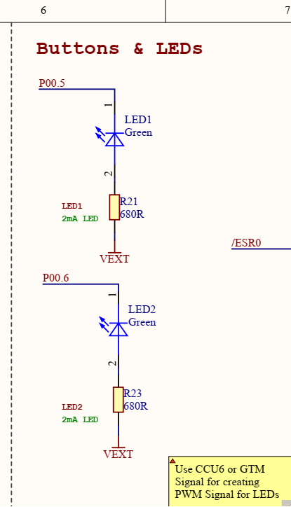

# Funpack第二季第二期：KIT_AURIX_TC275_LITE 活动

**活动主页：[Funpack第二季第二期：KIT_AURIX_TC275_LITE - 电子森林 (eetree.cn)](https://www.eetree.cn/project/detail/1101)**

有幸参加**硬禾学堂**、**得捷电子**和**英飞凌**举办的这一期的活动，了解嵌入式相关的知识和英飞凌单片机的使用。

## 1、板卡介绍

AURIX TM TC275 lite 套件配备了基于 32 位单芯片 AURIX TM TriCore TM的微控制器 Aurix TM TC275。它可以与一系列开发工具一起使用，包括 AURIX TM Development Studio、英飞凌免费的基于 Eclipse 的 IDE，或来自 Hightec/PLS/Infineon 的基于 Eclipse 的“FreeEntryToolchain”。

特性：

Arduino 连接器

Arduino ICSP 连接器

稳压器 5V 至 3.3V

可选 0 欧姆电阻器（1210 英制中的 R39_opt/R40_opt）

Arduino 连接器（数字）

用于 AURIX™ TM的 20 MHz 晶振和用于 OCDS 的 12 MHz 晶振

用于 WIFI/BLE 的 Mikrobus 连接器

英飞凌 CAN 收发器 TLE9251VSJ 和 CAN 连接器

针连接器 X2

电源指示灯 (D5)

LED D1/D2 用于 ADBUS7/4 和 LED3 用于 ESR0 信号（低电平有效）

Arduino 针连接器（电源和模拟输入）

电位器 (10 kOhm) 和可焊接的 0 Ohm 电阻器（0805 英制中的 R33）

微型 USB（推荐 USB3.0）

10 针 DAP 连接器

复位按钮

2 x Shield2GO 连接器，用于 Infineon Maker Shields

EEPROM 1Kbit

## 2、任务目标

任务二：

设计一个呼吸灯，通过旋转板卡上的电位计，改变呼吸灯闪烁速率，同时将ADC采集的数据通过串口/CAN，发送到另一台设备上显示。

详细描述：

呼吸灯使用的两个LED灯，LED1变亮的时候LED2变暗，作为对比显示PWM调光的作用。使用12位ADC读取板卡的电位计（电位计的电压是3.3V，ADC的量程是0-4095）。使用板卡内部资源GTM定时器产生PWM波对LED灯进行调光。使用串口发送ADC和值和换算之后的电压值到串口调试助手上面。

## 3、开发环境

win10专业版，串口调试助手：fireTools.exe，开发工具：AURIX Development Studio

### 3.1、编译软件的安装

**AURIX Development Studio**的安装和下载均可以参考网上的教程来做，串口调试助手用哪个都可以。

安装教程：[AURIX™ Development Studio 安装使用_lijk15的博客-CSDN博客](https://blog.csdn.net/lijk15/article/details/108896484)

软件的下载地址：[Tool overview - Infineon Developer Center](https://softwaretools.infineon.com/tools?q=aurix)

软件的使用教程可参考硬禾学堂发布的文章，[英飞凌AURIX Development Studio安装和使用，助力Funpack2-2 - 哔哩哔哩 (bilibili.com)](https://www.bilibili.com/read/cv17627610?spm_id_from=333.999.0.0)

**注意**：安装的时候请务必保证ADS安装路径没有中文与空格！初次打开需要选定工作空间路径，请注意工作空间路径不要包含中文以及空格！

## 4、应用开发

根据任务要求已经知道了要做哪些事情，可以将任务分成：**串口**、**ADC**、**PWM**、**LED** 灯几个部分来完成。

### 4.1、LED灯点灯部分

参考资料：[Blinky LED (infineon.com)](https://www.infineon.com/dgdl/Infineon-Blinky_LED_1_KIT_TC275_LK-Training-v01_02-EN.pdf?fileId=5546d4627a0b0c7b017a586733384c8a)

电路图如下



代码讲解

```c
/*********************************************************************************************************************/
/*-----------------------------------------------------Includes------------------------------------------------------*/
/*********************************************************************************************************************/
#include "IfxPort.h"   
#include "Bsp.h"

/*********************************************************************************************************************/
/*------------------------------------------------------Macros-------------------------------------------------------*/
/*********************************************************************************************************************/
#define LED         &MODULE_P00,6                                              /* LED: Port, Pin definition            */
#define WAIT_TIME   1000                                                     /* Wait time constant in milliseconds   */

/*********************************************************************************************************************/
/*---------------------------------------------Function Implementations----------------------------------------------*/
/*********************************************************************************************************************/
/* This function initializes the port pin which drives the LED */
void initLED(void)
{
    /* Initialization of the LED used in this example */
    IfxPort_setPinModeOutput(LED, IfxPort_OutputMode_pushPull, IfxPort_OutputIdx_general);

    /* Switch OFF the LED (low-level active) */
    IfxPort_setPinHigh(LED);
}

/* This function toggles the port pin and wait 500 milliseconds */
void blinkLED(void)
{
    IfxPort_togglePin(LED);                                                     /* Toggle the state of the LED      */
    waitTime(IfxStm_getTicksFromMilliseconds(BSP_DEFAULT_TIMER, WAIT_TIME));    /* Wait 500 milliseconds            */
}
```


### 4.2、串口学习部分

参考资料：

### 4.3、ADC 学习部分


### 4.4、PWM 学习部分


### 4.5、整合部分


